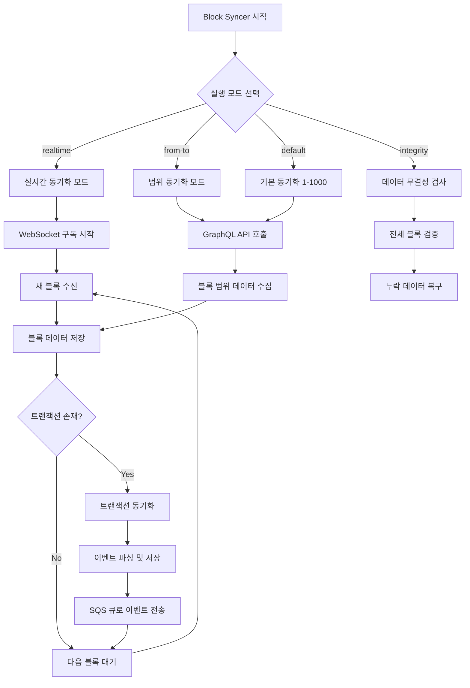
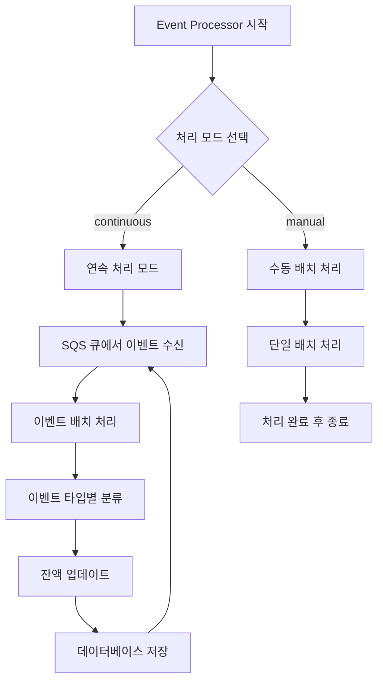
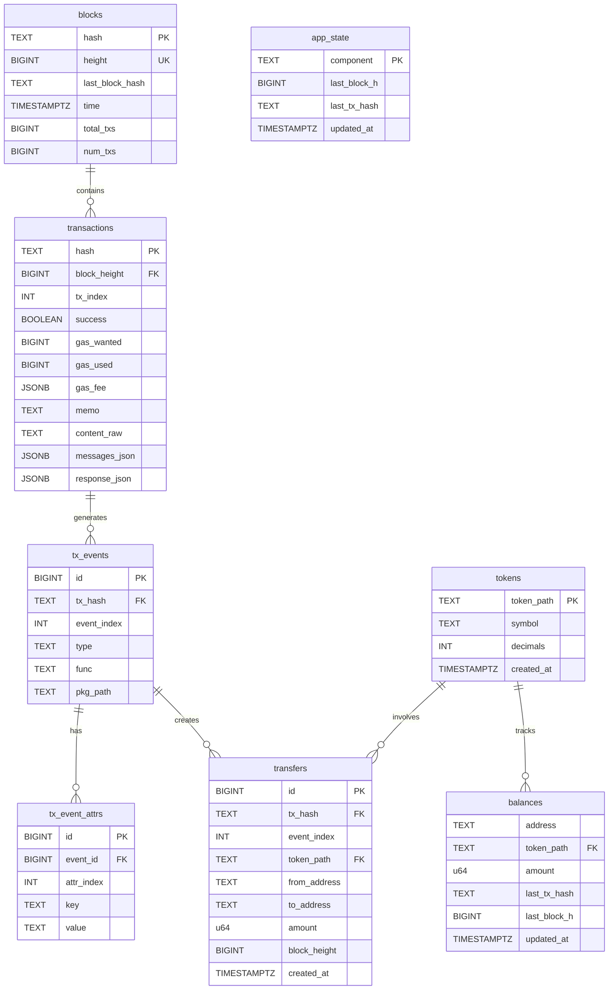

# GN Indexer 
GN Indexer는 블록체인 데이터를 실시간으로 동기화하고 처리하는 MSA(Microservice Architecture) 기반 시스템입니다. <br/>
각 서비스는 독립적으로 실행되며 SQS 큐를 통해 비동기적으로 통신합니다. <br/>
과제라는 특성 상 설치·공유·환경 세팅 편의에 중점을 둬 monorepo 로 통합하여 작업했습니다, 상황에 맞춰 분리하는 게 좋습니다. 

아래 인덱서에서 선택으로 블록체인 데이터를 구독해서 가져옵니다
- Indexer 1:  https://dev-indexer.api.gnoswap.io/graphql <br/>
- Indexer 2: https://indexer.onbloc.xyz/graphql

참고
- Gno.land Docs: https://docs.gno.land/
- Tx Indexer 저장소: https://github.com/gnolang/tx-indexer

## 실행 방법
### 1. 프로젝트 클론 및 의존성 설치

```bash
# 프로젝트 클론
git clone <repository-url>
cd gn-indexer

# Go 모듈 의존성 다운로드
go mod download

# Go 모듈 의존성 정리
go mod tidy
```

### 2. 환경 변수 설정
프로젝트 루트에 `.env` 파일를 그대로 사용하셔도 됩니다.

### 3. Docker 인프라 실행

```bash
# 처음 실행 시 (빌드 포함)
docker-compose up -d --build

# 기존 실행
docker-compose up -d

# 상태 확인
docker-compose ps

# 로그 확인
docker-compose logs -f
```

### 4. 서비스 실행 명령어 

### 1. 블록 동기화 서비스 (Producer)

```bash
# 실시간 동기화 모드
go run ./cmd/block-syncer -realtime

# 특정 범위 동기화
go run ./cmd/block-syncer -from 1 -to 1000

# 데이터 무결성 검사
go run ./cmd/block-syncer -integrity
```

### 2. 잔액 조회 API 서비스

```bash
# Balance API 서버 실행
go run ./cmd/balance-api
```

### 3. 이벤트 처리 서비스 (Consumer)

```bash
# Event Processor 서비스 실행
go run ./cmd/event-processor
```

## 사용 시나리오

아래 명령어를 각각 실행하되 주의해야할 점은 realtime을 먼저 한 후, integrity를 실행해야지 백필 서버로써 누락 없이 데이터를 저장할 수 있음 
```bash
go run ./cmd/block-syncer -realtime
go run ./cmd/block-syncer -integrity
go run ./cmd/event-processor
go run ./cmd/balance-api
```

## 주요 프로세스 흐름도
mermaid로 흐름도 표현

### 1. 블록 동기화 프로세스 (Producer)



### 2. 이벤트 처리 프로세스 (Consumer)



### 3. 잔액 조회 API 프로세스

```mermaid
flowchart TD
    A[Balance API 시작] --> B[HTTP 서버 시작]
    B --> C[API 엔드포인트 등록]
    C --> D[요청 대기]
    
    D --> E{API 요청 타입}
    E -->|GET /health| F[헬스 체크 응답]
    E -->|GET /tokens/balances| G[토큰 잔액 조회]
    E -->|GET /tokens/transfer-history| H[전송 내역 조회]
    E -->|GET /tokens/{tokenPath}/balances| I[특정 토큰 잔액 조회]
    
    G --> J[데이터베이스 쿼리]
    H --> J
    I --> J
    J --> K[JSON 응답 반환]
    F --> K
    K --> D
```

## 데이터 흐름도

### 1. 블록 데이터 수집 단계

```
Blockchain GraphQL API
    ↓
Block Syncer (Producer)
    ↓
블록 데이터 저장 (PostgreSQL)
    ↓
트랜잭션 동기화 (GraphQL API)
    ↓
Event Storage Service 호출
    ↓
이벤트 파싱 및 정규화
    ↓
데이터베이스 저장 (이벤트, 속성, 전송)
    ↓
SQS 큐 전송
```

### 2. 이벤트 처리 단계

```
SQS 큐 (Long Polling)
    ↓
Event Processor (Consumer)
    ↓
이벤트 타입별 분류 (MINT/BURN/TRANSFER)
    ↓
Balance Service 호출
    ↓
잔액 계산 및 업데이트
    ↓
데이터베이스 저장
```

### 3. API 응답 단계

```
HTTP 요청
    ↓
Balance API (Gin Router)
    ↓
Balance Handler
    ↓
Repository Layer
    ↓
데이터베이스 쿼리
    ↓
데이터 집계 및 가공
    ↓
JSON 응답 반환
```

## 폴더 구조
```
gn-indexer/
├── cmd/                    # 메인 애플리케이션 진입점
│   ├── block-syncer/       # 블록 동기화 서비스 (Producer)
│   ├── balance-api/        # 잔액 조회 API 서비스
│   └── event-processor/    # 이벤트 처리 서비스 (Consumer)
├── internal/               # 내부 패키지들
│   ├── client/             # 외부 API 통신 (HTTP, WebSocket)
│   ├── producer/           # Producer 로직 (블록 동기화)
│   ├── consumer/           # Consumer 로직 (이벤트 처리)
│   ├── types/              # 공통 타입 정의
│   ├── service/            # 비즈니스 로직 서비스
│   ├── domain/             # 도메인 모델
│   ├── repository/         # 데이터 접근 계층
│   ├── queue/              # 메시지 큐 처리
│   ├── api/                # API 관련
│   └── config/             # 설정 관리
├── db/                     # 데이터베이스 관련 파일
├── docs/                   # 프로젝트 문서
├── docker-compose.yml      # Docker 환경 설정
├── go.mod                  # Go 모듈 정의
├── go.sum                  # Go 모듈 체크섬
└── README.md
```

## 설계 의도
GN Indexer는 **블록체인 데이터에 백필 서버로 실시간으로 동기화하고 인덱싱하여 빠른 조회가 가능한 API 서비스**를 제공하는 것이 최종 목표입니다.

블록체인 백필 서버라는 특성 상 아래 4가지 항목이 가장 중요합니다.
- **실시간성**: 새로운 블록과 트랜잭션을 즉시 처리
- **신뢰성**: 데이터 무결성 보장 및 장애 복구
- **확장성**: MSA 아키텍처로 독립적인 서비스 확장
- **성능**: 빠른 데이터 조회 및 처리

※ 테스트 코드를 통한 신뢰성 확보를 더 하고 싶었지만 재량 부족으로 추가하지 못했습니다.

GN Indexer는 아래 3가지 프로젝트를 포함한 프로젝트입니다. 
```
Block Syncer ←→ Event Processor ←→ Balance API
     ↑              ↑              ↑
독립적 실행      독립적 실행      독립적 실행
독립적 확장      독립적 확장      독립적 확장
```
- **Block Syncer**: 블록체인 데이터 수집
- **Event Processor**: 이벤트 처리 및 잔액 계산
- **Balance API**: 데이터 조회 및 API 응답

### SQS 사용 이유
- 서비스 간의 의존성 제거
- Producer와 Consumer의 독립적 실행
- 메시지 손실 방지

※ 여기에 Redis를 적용한다면 Redis로 속도를 가져오고, SQS로 안정성을 챙기는 전략으로 갈거 같습니다.
Redis가 압도적으로 빠른 대신 백업/영송성 측면에서는 SQS가 좋기 때문이죠.

### 데이터 수집과 처리의 분리
```
Producer (Block Syncer)
    ↓
데이터 수집 및 저장
    ↓
이벤트 큐 전송
    ↓
Consumer (Event Processor)
    ↓
비즈니스 로직 처리
```
- **데이터 수집 속도**와 **처리 속도**를 독립적으로 조절
- **블록체인 동기화 지연**이 **API 응답 속도**에 영향 주지 않음
- **처리 부하 분산**으로 전체 시스템 안정성 향상

### 계층별 책임 분리
```
Domain Layer: 비즈니스 엔티티 정의
Repository Layer: 데이터 접근 추상화
Service Layer: 비즈니스 로직 처리
API Layer: 외부 인터페이스
```

**설계 의도:**
- **테스트 용이성** 향상 (각 계층별 독립적 테스트가 가능함)
- **코드 재사용성** 증가
- **유지보수성** 향상

### 재시도 및 복구
```
블록 동기화 실패 → 최대 3회 재시도 → 실패 시 건너뛰기
이벤트 처리 실패 → SQS 가시성 타임아웃 → 자동 재처리
```

**설계 의도:**
- **일시적 장애**에 대한 **자동 복구**
- **데이터 손실 최소화**
- **시스템 가용성** 향상


## 데이터베이스 구조

### 테이블 구조

| 테이블명 | 주요 용도       | 핵심 컬럼 |
|----------|-------------|------------|
| **blocks** | 블록 정보 관리    | `height`, `hash`, `time` |
| **transactions** | 트랜잭션 추적     | `hash`, `block_height`, `success` |
| **tx_events** | 이벤트 분류      | `type`, `func`, `pkg_path` |
| **tx_event_attrs** | 이벤트 상세      | `key`, `value` |
| **tokens** | 토큰 메타데이터    | `token_path`, `symbol`, `decimals` |
| **transfers** | 전송 내역 관리    | `from_address`, `to_address`, `amount` |
| **balances** | 잔액 조회       | `address`, `token_path`, `amount` |
| **app_state** | 동기화 상태(미구현) | `component`, `last_block_h` |

### **데이터 수집 계층**
- **blocks**: 블록체인 동기화의 기초
- **transactions**: 트랜잭션 데이터 수집 및 저장

### **이벤트 처리 계층**
- **tx_events**: 이벤트 타입별 분류 및 관리
- **tx_event_attrs**: 이벤트 상세 정보 저장

### **비즈니스 로직 계층**
- **tokens**: 토큰 정보 관리
- **transfers**: 전송 이력 추적
- **balances**: 실시간 잔액 계산

### **시스템 모니터링 계층**
- **app_state**: 서비스 상태 및 동기화 진행률 모니터링 (비즈니스 로직 미구현)

### 테이블 데이터 흐름
```
1. 블록 수신 → blocks 테이블 저장
2. 트랜잭션 파싱 → transactions 테이블 저장
3. 이벤트 추출 → tx_events, tx_event_attrs 테이블 저장
4. 전송 처리 → transfers 테이블 저장
5. 잔액 업데이트 → balances 테이블 업데이트
6. 상태 추적 → app_state 테이블 업데이트 (미구현)
```


### 테이블 관계도 


## 파싱 문제
원래 의도대로는 Block > Transaction > Event를 추출하려고 했었습니다. <br/>
그러나 가이드 문서에는 표시되어서 이벤트에 있어야할 토큰 이벤트 명칭 (func: Mint, Burn, Transfer)이 아래 샘플 데이터처럼 존재하지 않았습니다.<br/>
Type도 Transfer가 아닌 register, StorageDeposit 처럼 알 수 없는 값이 많았고 func은 값 자체가 없어서 현재 프로젝트는 요구사항대로 구현해두었지만 실제로 돌려보면 event, balance 부분은 업데이트 되지 않고 있습니다. <br/>
공식 문서를 파악해가며 분석하면 해결할 수 있었지만 물리적인 한계로 앞에 정리한 내용대로 구현해두었습니다.

```json
{
  "events": [
    {
      "func": "",
      "type": "Transfer",
      "attrs": [
        {
          "key": "token",
          "value": "gno.land/r/gnoswap/v1/test_token/baz.BAZ"
        },
        {
          "key": "from",
          "value": ""
        },
        {
          "key": "to",
          "value": "g17290cwvmrapvp869xfnhhawa8sm9edpufzat7d"
        },
        {
          "key": "value",
          "value": "100000000000000"
        }
      ],
      "pkg_path": "gno.land/p/demo/grc/grc20"
    },
    {
      "func": "",
      "type": "register",
      "attrs": [
        {
          "key": "pkgpath",
          "value": "gno.land/r/gnoswap/v1/test_token/baz"
        },
        {
          "key": "slug",
          "value": ""
        }
      ],
      "pkg_path": "gno.land/r/demo/grc20reg"
    },
    {
      "func": "",
      "type": "StorageDeposit",
      "attrs": [
        {
          "key": "Deposit",
          "value": "220300ugnot"
        },
        {
          "key": "Storage",
          "value": "2203 bytes"
        }
      ],
      "pkg_path": "gno.land/r/demo/grc20reg"
    },
    {
      "func": "",
      "type": "StorageDeposit",
      "attrs": [
        {
          "key": "Deposit",
          "value": "1548500ugnot"
        },
        {
          "key": "Storage",
          "value": "15485 bytes"
        }
      ],
      "pkg_path": "gno.land/r/gnoswap/v1/test_token/baz"
    }
  ]
}
```

## 고도화
후에 적용을 고려하거나 시행되어야 할 점

- Redis를 이용한 속도 향상
- MonoRepo 구조에서 벗어나기 위한 프로젝트 분리 
- 모델, 도메인 분리해서 비즈니스 로직과 데이터베이스 접근 구조체를 나눠야 함
- 단위 테스트 로직 추가
- 데이터 파싱 문제 해결
- 데이터 누락 시나리오 추가 분석 
- 예기치 못한 이슈로 프로세스가 죽었을 때 app state를 통한 상태 추적 
- 아키텍쳐 구조 체크, MSA 에 정말 맞는 구조인지

## 실행 명령어

### 1. 도커 인프라
```bash
# 처음 실행 또는 설정 변경 시
docker-compose up -d --build

# 기존 실행
docker-compose up -d

# 재시작
docker-compose restart

# 중지
docker-compose down

# 재빌드
docker-compose down -v
docker-compose up -d --build
```

### 2. 블록 동기화 + 이벤트 처리
```bash
# 실시간 동기화 (Producer + Consumer)
go run ./cmd/block-syncer -realtime

# 특정 범위 동기화
go run ./cmd/block-syncer -from 1 -to 1000

# 데이터 무결성 검사
go run ./cmd/block-syncer -integrity
```

### 3. 개별 서비스
```bash
# Balance API
go run ./cmd/balance-api

# Event Processor  
go run ./cmd/event-processor
```

## SQS 테스트

### 기본 테스트
```bash
# 큐 목록 확인
aws --endpoint-url http://127.0.0.1:4566 sqs list-queues

# 테스트 메시지 전송
aws --endpoint-url http://127.0.0.1:4566 sqs send-message --queue-url "http://sqs.ap-northeast-2.localhost.localstack.cloud:4566/000000000000/gn-token-events" --message-body "{\"test\": \"message\"}"

# 메시지 수신
aws --endpoint-url http://127.0.0.1:4566 sqs receive-message --queue-url "http://sqs.ap-northeast-2.localhost.localstack.cloud:4566/000000000000/gn-token-events"
```

### PowerShell (Windows)
```powershell
# 큐 목록 확인
aws --endpoint-url http://127.0.0.1:4566 sqs list-queues

# 테스트 메시지 전송
aws --endpoint-url http://127.0.0.1:4566 sqs send-message --queue-url "http://sqs.ap-northeast-2.localhost.localstack.cloud:4566/000000000000/gn-token-events" --message-body "{\"test\": \"message\"}"

# 메시지 수신
aws --endpoint-url http://127.0.0.1:4566 sqs receive-message --queue-url "http://sqs.ap-northeast-2.localhost.localstack.cloud:4566/000000000000/gn-token-events"
```
